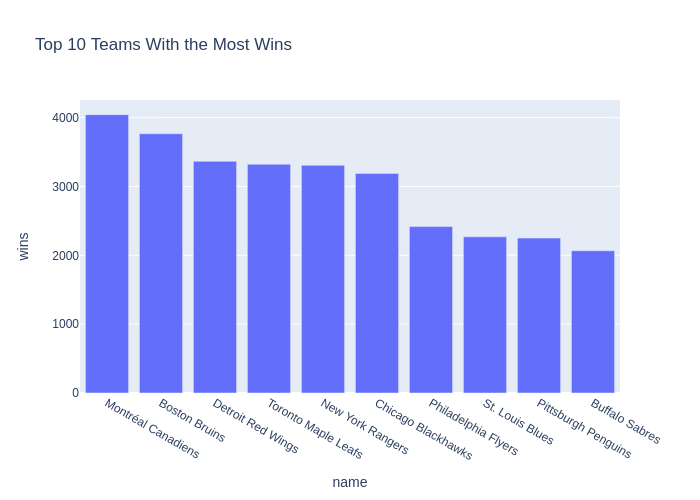
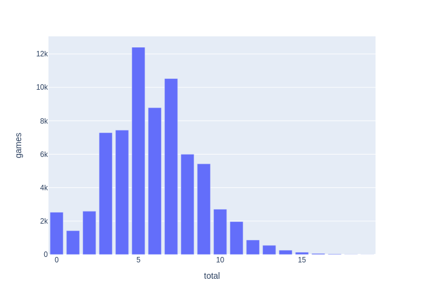

# Skrimmage Dagster

This is a [Dagster](https://dagster.io/) project scaffolded with [`dagster project scaffold`](https://docs.dagster.io/getting-started/create-new-project).

This project pulls data from the NHL API, loads data into the DuckDB, and generates charts

Teams with the most wins - Top 10



Number of games with Total Goals in the game



Asset Diagram


## How to run on my own server:

0. Check to make sure the /opt folder is ready
1. `$ nohup dagster-webserver -h 0.0.0.0 -p 4444 -l /dagster &`
2. `$ nohup dagster-daemon run &`

Will figure out more steps as I continue making this work.

**Dagster generated README follows:**
## Getting started

First, install your Dagster code location as a Python package. By using the --editable flag, pip will install your Python package in ["editable mode"](https://pip.pypa.io/en/latest/topics/local-project-installs/#editable-installs) so that as you develop, local code changes will automatically apply.

```bash
pip install -e ".[dev]"
```

Then, start the Dagster UI web server:

```bash
dagster dev
```

Open http://localhost:3000 with your browser to see the project.

You can start writing assets in `skrimmage/assets.py`. The assets are automatically loaded into the Dagster code location as you define them.

## Development


### Adding new Python dependencies

You can specify new Python dependencies in `setup.py`.

### Unit testing

Tests are in the `skrimmage_tests` directory and you can run tests using `pytest`:

```bash
pytest skrimmage_tests
```

### Schedules and sensors

If you want to enable Dagster [Schedules](https://docs.dagster.io/concepts/partitions-schedules-sensors/schedules) or [Sensors](https://docs.dagster.io/concepts/partitions-schedules-sensors/sensors) for your jobs, the [Dagster Daemon](https://docs.dagster.io/deployment/dagster-daemon) process must be running. This is done automatically when you run `dagster dev`.

Once your Dagster Daemon is running, you can start turning on schedules and sensors for your jobs.

## Deploy on Dagster Cloud

The easiest way to deploy your Dagster project is to use Dagster Cloud.

Check out the [Dagster Cloud Documentation](https://docs.dagster.cloud) to learn more.
